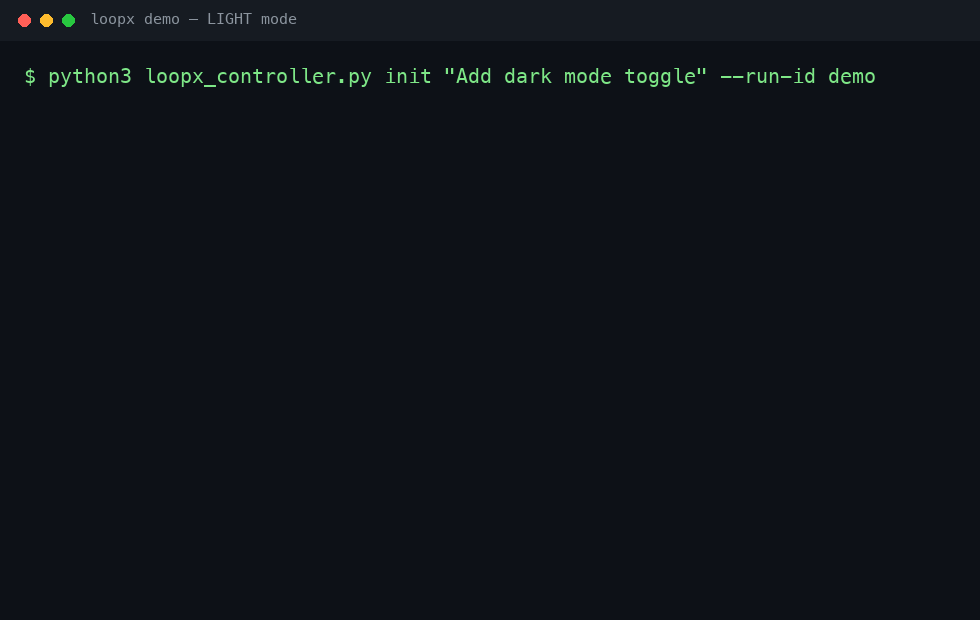

# LoopX

[](https://github.com/rye567/loopx/actions/workflows/ci.yml)
[](LICENSE)
[](https://github.com/rye567/loopx/releases)

Staged workflow checks for AI coding agents.

[中文说明](README.zh-CN.md)

```mermaid
flowchart LR
    A["Init<br/>env check"] --> B["Requirement<br/>intake + interview"]
    B -->|"confirm-stage<br/>human confirmation"| C["Spec draft<br/>+ review"]
    C --> D["Mode select<br/>LIGHT / STANDARD / FULL"]
    D --> E["Solution design<br/>+ review"]
    E -->|"confirm-stage<br/>human confirmation"| F["Test design<br/>+ review"]
    F --> G["Development<br/>can-write unlocks here"]
    G --> H["Quality audit<br/>code review<br/>test execution"]
    H --> I["Health check<br/>release readiness"]
    I --> J["Final report<br/>final check + close"]
```





LoopX is a Git-maintained skill package for Codex and Claude Code. It keeps AI coding work from jumping straight into implementation by guiding risky changes through requirement interview, spec drafting, human-confirmed reviews, test planning, implementation, and release checks.

Use it when an agent is about to touch cross-module behavior, API contracts, permissions, tenant boundaries, state machines, SQL/MQ flows, or anything where "looks done" is not good enough.

## Why LoopX

AI coding agents are fast, but they often skip requirements, invent acceptance criteria, mark reviews as passed without evidence, or edit business logic before the plan has been checked. LoopX adds a local controller and a staged workflow so every meaningful change leaves auditable artifacts before code changes ship.

| Without LoopX | With LoopX |
| --- | --- |
| Agent starts coding from a vague prompt | Agent starts with requirement intake and interview |
| Acceptance criteria are implied | Spec artifacts are generated and reviewed |
| Reviews can be hand-waved | Reviews require recorded evidence |
| High-risk edits happen too early | Business writes wait until review checks pass |
| "Done" is a chat message | Final check records local checks, gaps, and release readiness |

## Workflow

```text
request
  -> environment check
  -> requirement intake
  -> requirement interview
  -> spec draft
  -> spec review
  -> mode selection
  -> solution design
  -> solution review
  -> test design
  -> test review
  -> implementation
  -> quality audit
  -> code review
  -> validation (test execution)
  -> health check
  -> release readiness
  -> final report
```

The workflow contract lives in [`loopx/workflow.md`](loopx/workflow.md). New runs are stored in the platform user-state directory as one `<project-id>/<run_id>/run.json` file at rest, so the project receives no workflow-control JSON. The existing logical state, worklist, event, stage-result, and generated-artifact files remain inside that container, preserving controller behavior. `LOOPX_STATE_DIR` overrides the state root and `LOOPX_STATE_BACKEND=project` selects the legacy project-directory backend; existing `docs/loopx/runs/<run_id>/` runs remain readable in place and are never migrated or deleted automatically. LoopX can also record a Compound Capture decision before close: skipped when there is no reusable learning, or captured into `docs/loopx/solutions/<category>/<slug>.md` when explicitly enabled.

## Install

### Plugin marketplace (recommended)

LoopX ships as a self-hosted plugin marketplace. In ZCode or Claude Code, add
the marketplace once, then install the plugin — updates follow new tags:

```bash
plugin marketplace add https://github.com/rye567/loopx
plugin install loopx
```

For Codex, the same repository provides a `.codex-plugin/plugin.json`
manifest; add it through your Codex plugin flow.

### Manual link (alternative)

Clone the repository and link or copy the [`loopx/`](loopx/) directory into
your tool's skills directory, keeping the directory name as `loopx`:

```bash
git clone git@github.com:rye567/loopx.git
cd loopx
ln -s "$PWD/loopx" "$HOME/.codex/skills/loopx"
ln -s "$PWD/loopx" "$HOME/.claude/skills/loopx"
```

PowerShell (Windows):

```powershell
New-Item -ItemType Junction `
  -Path "$HOME\.codex\skills\loopx" `
  -Target "E:\workspace\loopx\loopx"

New-Item -ItemType Junction `
  -Path "$HOME\.claude\skills\loopx" `
  -Target "E:\workspace\loopx\loopx"
```

## Use

```text
Codex: $loopx handle this requirement: ...
Claude Code: /loopx handle this requirement: ...
```

See [`docs/demo.md`](docs/demo.md) for a copy-paste end-to-end demo — a full
LIGHT-mode run from `init` to `close` in ~20 commands. Or read
[`docs/why-loopx.md`](docs/why-loopx.md) for the background and design rationale.

For project-local reminders, add a short note to your project docs:

```text
When the user asks for LoopX, staged delivery, or structured engineering review, use the installed loopx skill. Read the current project README, build files, primary configuration, source layout, and tests before running the LoopX stages.
```

## Controller Quickstart

Start a run:

```bash
python loopx/tools/loopx_controller.py init "Add tenant-scoped API access" --mode auto --risk-tags tenant_scope api_contract
```

Inspect progress:

```bash
python loopx/tools/loopx_controller.py status --tracking
```

Run validation and checks:

```bash
python loopx/tools/loopx_controller.py validate --strict
python loopx/tools/loopx_controller.py gate <run_id>
python loopx/tools/loopx_controller.py git-gate <run_id>
python loopx/tools/loopx_controller.py close <run_id>
```

Before writing business logic, LoopX expects the relevant human-confirmed reviews to pass:

```bash
python loopx/tools/loopx_controller.py can-write --kind business
```

## What Is Included

- `loopx/SKILL.md`: the Codex and Claude Code skill entry point
- `loopx/workflow.md`: the staged workflow contract
- `loopx/standards/`: engineering principles, topic standards, and the versioned rule catalog
- `loopx/agents/`: role instructions for each review stage
- `loopx/templates/`: artifact templates for interviews, specs, reviews, and release reports
- `loopx/schemas/`: JSON schemas for state, stage results, policies, and structured solution, test, development, quality, performance, and security artifacts
- `loopx/tools/loopx_controller.py`: the local state controller
- `loopx/tools/loopx_check.py`: health and package checks
- `tests/`: regression tests for the controller and skill package

## Project Fit

LoopX is useful when:

- The change crosses module or ownership boundaries.
- A vague request needs to become an explicit spec.
- Review evidence matters more than agent confidence.
- The project has security, tenant, permission, data, or state-transition risk.
- Multiple agents or tools need one shared workflow contract.

LoopX is probably too heavy for:

- One-line copy changes.
- Throwaway prototypes.
- Purely exploratory spikes with no release intent.

## Update

```bash
git pull
```

If you installed LoopX with a link or junction, updates to this repository are available to Codex and Claude Code immediately.

## License

MIT. See [`LICENSE`](LICENSE).
