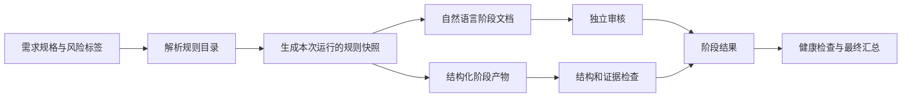

# 02 方案设计

## 状态

- 方案设计：第 3 版，等待独立审核。
- 执行等级：FULL。
- 需求规格：`docs/loopx/runs/2026-08-17-loopx/artifacts/spec.md`。

## 设计目标

1. 保留现有 17 个正式阶段和主要命令。
2. 把分散的工程要求整理为可识别、可版本化、可按风险应用的规则。
3. 同时保留自然语言文档和机器可验证的结构化证据。
4. 让阶段通过结论依赖真实产物、规则结果和有效证据，而不是只依赖状态字段。
5. 核心检查继续只依赖 Python 标准库，外部工具按项目配置接入。
6. 旧运行记录不原地迁移，并能继续推进和收口。

## 设计原则

- 正确性和安全优先：必需检查缺失或无法判断时停止推进。
- 简单优先：沿用现有标准、风险、健康检查、结构定义和控制器模块，不引入第二套流程引擎。
- 只解决已确认问题：不新增正式阶段，不提前接入全部外部工具，不设置通用固定指标。
- 单一事实来源：规则适用性来自固定版本的规则快照；人类文档负责解释，结构化产物负责校验。
- 向后兼容：内部阶段 ID 和主要命令保留；用户可见标题和说明使用自然表达。
- 可扩展但不预埋业务：外部工具只通过通用结果格式接入，核心不保存工具私有字段。

## 当前约束依据

| 事实 | 证据 |
| --- | --- |
| 正式流程已有 17 个阶段 | `loopx/workflow.md:114-132` |
| `record-stage` 当前直接接收通用证据并记录结果 | `loopx/tools/loopx_controller_core.py:369-390` |
| `--evidence` 当前允许为空 | `loopx/tools/loopx_controller_core.py:502-510` |
| 通用严格检查对采访和规格执行正文内容检查；经验沉淀另有标题和正文检查 | `loopx/tools/loopx_controller_validation.py:94-148`、`loopx/tools/loopx_controller_compound.py:136-148` |
| 健康检查配置声明了六项检查，但内置项目检查只执行四类固定检查 | `loopx/health.yml:9-15`、`loopx/tools/loopx_check.py:288-304` |
| 现有 500 行和 60 行只是文档默认值，程序没有执行对应检查 | `loopx/standards/quality-standard.md:37-45`、`loopx/tools/loopx_check.py:261-273` |
| 方案模板缺少安全、性能、扩展和可观测性结构 | `loopx/templates/02-solution.md:3-10` |

## 总体结构



规则目录只在新运行初始化时解析一次，并把本次风险与项目配置相关的候选规则写入快照。执行等级选择只能在 `mode_selection` 阶段进行；若用户改选等级，控制器从快照中的固定候选规则生成新的等级视图，不重新读取可能已经变化的全局规则。等级选择完成后，后续阶段只使用该快照，因此判断不会随仓库更新而漂移。

## 一、标准体系

### 1. 人类可读标准

新增：

- `loopx/standards/principles.md`：正确、安全、简单、兼容、可验证的优先顺序。
- `loopx/standards/architecture-standard.md`：模块边界、依赖方向、数据与事务、兼容和扩展决策。
- `loopx/standards/security-standard.md`：身份、权限、租户、输入、敏感数据、依赖和外部副作用。
- `loopx/standards/performance-standard.md`：指标来源、负载条件、环境、基线、允许变化和结果证据。
- `loopx/standards/reliability-observability-standard.md`：超时、重试、幂等、恢复、日志、指标和告警。

同步完善现有 requirement、development、testing、quality 和 release 标准。每份文档解释规则目的、适用场景、正反例、证据要求和失败后返回阶段，不重复维护机器字段全集。

### 2. 机器可读规则目录

新增 `loopx/standards/catalog.yml`，作为规则元数据的唯一来源：

```yaml
catalog_version: "2"
rule_sets:
  common: []
  architecture: []
  security: []
  performance: []
  reliability: []
  observability: []
  testing: []
rules:
  - id: ARCH-SIMPLE-001
    title: 选择满足需求的最小方案
    domain: architecture
    source: standards/architecture-standard.md
    stages:
      - solution_review
    modes:
      - STANDARD
      - FULL
    risk_tags_any: []
    level: required
    check:
      type: review
      id: solution_design_review
    evidence_types:
      - solution
    unavailable: BLOCKED
    return_to: solution_design
stage_contracts: {}
```

字段职责：

- `id`：稳定规则标识，改要求时保留标识并提升目录版本。
- `source`：指向解释文档，避免在目录中复制长篇规则。
- `stages`、`modes`、`risk_tags_any`：判断规则是否适用。
- `level`：区分必需和建议；建议项不阻断，但必须出现在报告中。
- `check`：声明规则如何检查，`type` 只允许 `schema`、`builtin`、`command`、`review`。
- `evidence_types`：声明通过该规则需要哪类结构化产物。
- `unavailable`：检查不可执行时的状态，只允许 BLOCKED、CI_REQUIRED、SKIPPED。
- `return_to`：失败时返回责任阶段。
- `stage_contracts`：声明各阶段必须提供的产物类型。

四类检查的职责固定如下：

- `schema`：使用 LoopX 支持的结构定义校验产物字段。
- `builtin`：调用控制器内登记的零依赖检查函数。
- `command`：执行项目配置提供的参数数组，不经过 shell。
- `review`：读取指定独立审核结论及其证据。

必需规则必须配置可解析的 `check`，不能只写说明。`review` 只能绑定产生该审核结论的阶段及其后续阶段，不能作为更早阶段的通过前提；更早阶段如需自动检查，必须拆成独立的 `schema` 或 `builtin` 规则。新增 `standard-catalog.schema.json` 校验目录。包完整性检查必须验证规则 ID 全局唯一、规则集合引用存在、阶段、模式、状态、产物类型、结构定义和检查标识合法、检查不存在向后依赖、解释文档存在。目录和项目策略的关键对象使用 `additionalProperties: false`，未知字段直接报错，避免拼写错误被忽略。

### 3. 风险与规则组合

扩充 `risk.yml`，保留现有模式评分，同时增加风险到规则集合的映射：

```yaml
risk_profiles:
  auth:
    minimum_mode: FULL
    rule_sets:
      - security
      - testing
  permission:
    minimum_mode: FULL
    rule_sets:
      - security
      - testing
  tenant_scope:
    minimum_mode: FULL
    rule_sets:
      - security
      - testing
  db_schema:
    minimum_mode: FULL
    rule_sets:
      - architecture
      - reliability
      - testing
  external_side_effect:
    minimum_mode: FULL
    rule_sets:
      - security
      - reliability
      - testing
  core_state_transition:
    minimum_mode: FULL
    rule_sets:
      - architecture
      - reliability
      - testing
  api_contract:
    minimum_mode: STANDARD
    rule_sets:
      - architecture
      - testing
  sql:
    minimum_mode: STANDARD
    rule_sets:
      - architecture
      - security
      - testing
  mq:
    minimum_mode: STANDARD
    rule_sets:
      - reliability
      - observability
      - testing
  async:
    minimum_mode: STANDARD
    rule_sets:
      - reliability
      - observability
      - testing
  dependency:
    minimum_mode: STANDARD
    rule_sets:
      - security
      - reliability
  config_or_secret:
    minimum_mode: STANDARD
    rule_sets:
      - security
  ambiguous_requirement:
    minimum_mode: STANDARD
    rule_sets:
      - common
      - testing
  test_only:
    minimum_mode: LIGHT
    rule_sets:
      - testing
  docs_only:
    minimum_mode: LIGHT
    rule_sets:
      - common
  performance:
    minimum_mode: STANDARD
    rule_sets:
      - performance
      - testing
  reliability:
    minimum_mode: STANDARD
    rule_sets:
      - reliability
      - observability
      - testing
```

风险配置只决定最低执行等级和规则集合，不保存具体性能或覆盖率数值。包完整性检查收集 `critical_triggers`、`score_rules` 和新增标准声明的全部风险标签，要求每个标签恰好有一个 profile；若某标签确实不增加规则，也必须配置空 `rule_sets` 和非空理由。反向也要检查 profile 不得引用未声明标签。这样新增风险标签时不能遗漏其执行含义。

### 4. 项目配置

支持可选的项目根文件 `loopx-policy.yml`，但 LoopX 不自动创建它。它只能：

- 提供项目阈值及其来源；
- 绑定项目检查命令；
- 增加或收紧规则；
- 声明由 CI 执行的检查。

它不能静默关闭公共必需规则。v2 降低某条规则要求时，必须在质量结果中按规则记录风险接受理由和真实用户确认文件；执行等级降级确认只适用于等级选择，不能替代逐规则确认。v1 保留原有兼容行为。

解析顺序为：公共目录 → 风险映射 → 匹配的项目类型配置 → 可选项目策略 → 已批准规格中的指标。后面的来源可以提供更具体的阈值，但不能无记录地降低公共必需规则。

## 二、运行版本与兼容

### 1. 新运行

新建运行时：

1. 在创建运行目录前校验规则目录。
2. 解析建议执行等级、风险、项目类型和可选项目策略。
3. 生成 `artifacts/policy-snapshot.json`，内容包括目录版本、固定候选规则、当前等级适用规则、阈值来源、命令来源和摘要值。
4. `state.json` 记录 `contract_version: "2"`、`catalog_version` 和快照路径。

快照使用 JSON，便于后续只依赖标准库读取；摘要使用标准库 SHA-256，用于发现运行中的快照被意外修改。用户在 `mode_selection` 改选等级时，快照视图、摘要、状态、工作清单、等级决定、阶段结果和事件作为一次提交更新；写入失败时恢复已替换文件。离开该阶段后不能再次改选等级。

### 2. 旧运行

- `state.json` 没有 `contract_version` 时按 v1 处理。
- v1 继续使用现有阶段结果和校验逻辑，不强制新增产物。
- v1 可以继续推进、执行严格检查和收口。
- 不自动改写旧 `state.json`、worklist 或阶段结果。
- 新增字段在通用 schema 中保持可选，v2 的必需性由版本化检查器负责。

这种分支只保留在兼容入口，v2 内部不混用 v1 规则。

### 3. 命令兼容矩阵

| 命令或行为 | v1 运行 | v2 运行 |
| --- | --- | --- |
| `init` | 不适用；不改写既有运行 | 新运行写入版本、规则快照及摘要 |
| `mode` | 保留原有选择行为 | 只在 `mode_selection` 执行，从固定候选规则生成等级视图并统一提交 |
| `record-stage` | 沿用现有阶段结果和证据字符串 | 校验结构化产物、规则结果和项目内证据路径后记录 |
| `validate --strict` | 沿用现有严格检查 | 增加快照、产物、规则结果和证据复核 |
| `health` | 只执行原有阶段、worklist、证据、清理和 CI 声明检查，不要求规则快照 | 执行增强后的全部健康检查 |
| `gate`、`close` | 由版本分派到现有逻辑 | 由版本分派到增强逻辑 |
| `can-write` | 参数和行为不变 | 参数和行为不变 |
| `compound` | 参数和行为不变 | 参数和行为不变 |

所有入口先读取 `contract_version` 再分派；任何 v1 命令都不得要求 v2 新字段。无版本字段夹具覆盖自由文本记录兼容，既有控制器与健康检查测试分别覆盖检查、修复、推进、健康检查和收口。

## 三、阶段产物与证据

### 1. 双产物形式

每个重要阶段保留两类产物：

- Markdown：给用户和审核者阅读，使用自然语言。
- JSON：给控制器验证，只保存可检查字段和证据引用。

JSON 不复制长篇方案说明，只保存决策编号、需求映射、规则结果和文档路径，避免双份事实来源。

### 2. 新增结构定义

- `solution.schema.json`：需求映射、决策、影响、质量属性、不适用理由、兼容、回滚、验证引用和可同步到 worklist 的工作项。
- `test-plan.schema.json`：验收标准与规则映射、数据准备、执行、断言、清理和清理验证。
- `development-evidence.schema.json`：变更文件、写入范围、依赖变化、验收映射和本地命令结果。
- `quality-result.schema.json`：规则结果、未解决项、CI 未覆盖和已接受风险。
- `performance-result.schema.json`：指标、单位、目标来源、负载、环境、基线、实际值和结论。
- `security-result.schema.json`：适用控制、验证方式、证据、未覆盖状态和剩余风险。

每个 JSON 都包含：

- `artifact_type`；
- `artifact_version`；
- `run_id`；
- `stage`；
- `document`；
- `requirement_ids`；
- 该类型专属内容。

控制器现有结构校验只覆盖类型、枚举、必填字段、对象属性和数组元素。v2 在这一受控子集上补充 `minItems`、`minLength` 和 `additionalProperties: false`；第一版不实现 `$ref`、`oneOf` 等完整 JSON Schema 能力，避免引入另一套复杂解释器。

跨字段约束由按产物类型登记的语义检查函数负责，不伪装成结构定义能力。第一版至少检查：

- 标记为不适用的质量属性必须有具体理由；
- 性能风险必须给出目标来源、负载条件、环境、基线和允许变化；
- 安全风险必须有对应控制项结果或明确的未覆盖状态；
- 测试映射覆盖全部验收标准和适用的必需规则；
- 规则结果、文档和证据路径相互一致。

### 3. 阶段结果扩展

`stage-result.schema.json` 新增可选 `contract_version`、`artifacts` 和 `rule_results`。v1 可以没有这些字段；v2 通过时必须满足当前阶段的 `stage_contracts`。

命令行保持原参数，并新增可重复参数：

```text
record-stage ... --artifact solution=path/to/solution.json
record-stage ... --artifact quality_result=path/to/quality-result.json
```

v2 中 `--evidence` 只接受项目根目录内的相对文件路径，用于命令输出、日志或补充证明，不再承担声明产物类型的职责。v1 保持现有证据字符串语义。

### 4. 证据检查

新增 `loopx_controller_evidence.py`：

- 只接受项目根目录内的相对路径；对项目根、项目策略、产物和证据路径执行 `Path.resolve(strict=True)`，要求目标是普通文件，并用 `resolved.relative_to(project_root.resolve())` 确认解析后的真实路径仍在项目内；拒绝路径穿越、符号链接越界、目录和缺失文件。
- 根据产物类型加载对应结构定义。
- 检查运行 ID、阶段、文档路径和结构版本一致。
- 检查适用必需规则都有结果。
- PASS 要求所有必需规则为 PASS，或存在合法的风险接受记录。
- CI_REQUIRED、SKIPPED 和 BLOCKED 按规则目录中的不可用策略判断，不能任意降级。
- v2 普通阶段不能直接使用阶段级 ACCEPTED_RISK；逐规则风险接受只能由 `quality_result.accepted_risks` 声明，必须包含匹配规则 ID、具体理由和真实确认文件。整体执行等级降级确认不能替代逐规则确认；v1 兼容和等级选择记录继续保留原状态值。

严格检查会重新执行相同验证，避免记录后文件被删除或替换。

v2 阶段记录为 PASS 还必须同时满足：

- 当前阶段至少有一个 `stage_contracts` 要求的产物，且所有必需产物齐全；
- 阶段结果的 `evidence` 是产物文档、产物结果和补充证据文件路径的非空并集；
- 每条适用的必需规则都有非空证据引用，且引用文件通过上述路径检查；
- 结构检查和语义检查全部完成，不能用一个宽泛的审核结论替代缺失的机器结果。

记录阶段结果采用先校验后提交：先在内存中完成参数解析、路径解析、结构检查、语义检查、规则汇总和下一状态计算；全部成功后，才一次性写入阶段结果、状态、worklist 和事件。任一检查失败时这四类文件均保持原样。定向测试在失败前后比较内容摘要，验证没有部分写入。

## 四、控制器修改

### 1. 新模块

- `loopx_controller_policy.py`：加载目录、解析风险和项目策略、生成并验证规则快照。
- `loopx_controller_evidence.py`：解析 `--artifact`、验证阶段产物和规则结果。
- `loopx_health.py`：执行健康检查配置，供控制器和 `loopx_check.py` 共用。

各模块只负责一个领域，避免继续扩大 `loopx_controller_core.py` 和 `loopx_check.py`。

### 2. 现有模块职责

- `loopx_controller_core.py`：新增兼容参数和命令协调，不承载规则细节。
- `loopx_controller_state.py`：初始化 v2 版本信息和规则快照引用。
- `loopx_controller_flow.py`：在保存 PASS 前调用证据检查；状态推进逻辑不变。
- `loopx_controller_validation.py`：v1 使用旧检查，v2 增加快照、产物和证据复核。
- `loopx_controller_contracts.py`：保留内部 ID，更新用户可见显示名称。
- `loopx_controller_yaml.py`：拒绝重复键，继续维持现有零依赖 YAML 子集。
- `loopx_controller_io.py`：扩充受控结构校验子集，并为关键结构启用未知字段拒绝策略。
- `loopx_check.py`：继续负责包和项目检查，具体健康检查委托给 `loopx_health.py`。

### 3. worklist 与写入范围

`can-write` 的参数和行为保持不变，不为 v2 扩大这个命令的职责。v2 的方案结构化产物新增 `work_items`，字段名直接复用现有 `worklist.schema.json`。方案阶段每项必须提供：

- `id`、`title`、`owner_agent` 和 `risk_tags`；
- `read_scope` 和 `write_scope`；
- `dependencies`；
- `validation`。

记录 `solution_design` 为 PASS 时，控制器先校验完整工作项集合，再同步到运行的 worklist，并补齐运行态默认值：`status: pending`、`evidence: []`、`failed_by: ""`、`return_to: ""`、`required_changes: []`。已有同名字段不允许由方案产物传入，防止伪造运行状态。

v2 使用一个公共工作项解析函数校验所有引用：`record-stage --item`、`fail-review --item`、`review-feedback --item`、`close-repair --item` 以及 `dependencies` 都只能引用同步后存在的 ID。同步前先检查 ID 唯一、依赖存在且无环；任一错误时不修改 worklist。v1 继续保留当前兼容行为。开发后的质量检查使用 Git diff 对照 worklist 的 `write_scope`，发现越界变更时返回对应工作项修复。

### 4. 配置与解析安全

- YAML 解析器在普通对象和列表内合并对象两条路径上都拒绝重复键，不允许后值静默覆盖前值。
- 规则目录、项目策略和关键产物结构拒绝未知字段；扩展只能使用明确预留的 `extensions` 对象。
- 项目命令配置保存为参数数组，使用 `subprocess` 的非 shell 方式执行，并设置可配置但有上限的超时。
- 证据和配置路径使用解析后的真实路径判断项目边界，符号链接不能绕过范围检查。

## 五、健康检查

新增控制器命令：

```text
python3 loopx/tools/loopx_controller.py health <run_id>
```

它读取 `health.yml` 并写入 `artifacts/health-result.json`，但不自动把阶段标记为通过。阶段结果仍由现有命令统一记录。

核心检查调整为：

- 必需阶段产物完整；
- worklist 无未解决项；
- 必需规则都已有结果；
- 所有证据文件存在；
- 测试数据清理已经验证，或明确不适用；
- CI 和远端缺口已声明；
- 已接受风险具有用户确认；
- 规则快照摘要有效。

`compound_capture_decision_recorded` 不再属于此处，因为经验沉淀发生在后续收口过程；它继续由最终严格检查负责。这样执行顺序与现有阶段顺序一致。

## 六、性能、安全、扩展与测试标准

### 性能

性能标准不提供通用目标值，只规定一个有效指标必须说明：指标名称、单位、目标来源、负载条件、验证环境、基线、实际值和允许变化范围。缺少目标来源时，命中性能风险的方案不能通过审核。

### 安全

公共安全底线覆盖凭据、输入、敏感信息和依赖。认证、权限、租户、外部副作用等风险会增加对应规则集合。外部命令使用参数数组执行，不使用 shell 拼接；设置超时，不自动安装工具，输出证据不得包含凭据。

### 扩展性

扩展点必须关联已确认的变化来源或兼容要求。没有真实变化来源时优先直接实现，不为了未来可能性增加抽象。公共接口变化必须说明调用方、消费者、版本和回滚方式。

### 测试

- 所有验收标准必须映射到至少一个测试。
- 所有适用必需规则必须映射到验证或明确的 CI 未覆盖状态。
- 必需测试必须全部通过。
- 测试创建的数据必须全部完成清理验证。
- 代码覆盖率只使用项目明确配置的阈值；没有配置时记录覆盖结果，但不使用 LoopX 自造数值阻断。
- 权限、租户、幂等、重试、并发和兼容风险需要对应反向或失败路径测试。

## 七、自然表达

修改范围包括 README、中文 README、`loopx/README.md`、SKILL、workflow、智能体说明、技能说明、阶段模板、最终报告，以及全部控制器命令的帮助、成功、错误、状态和下一步提示。内部命令名、阶段 ID 和结构字段为兼容保留，但其面向用户的解释统一使用自然中文。

首选表达：

- 用户确认；
- 审核确认；
- 健康检查；
- 质量检查；
- 流程检查；
- 输入检查；
- 跳过的检查。

内部 `health_gate`、`gate` 等 ID 和命令为兼容保留。正常的安全领域词汇不在替换范围内。新增定向测试覆盖顶层及全部子命令的 `--help`、常见成功输出、参数错误、流程错误、阶段状态和最终报告；只检查用户可见的流程称呼，不做单字符全仓替换。

## 八、文件影响

### 新增

- `loopx/standards/principles.md`
- `loopx/standards/architecture-standard.md`
- `loopx/standards/security-standard.md`
- `loopx/standards/performance-standard.md`
- `loopx/standards/reliability-observability-standard.md`
- `loopx/standards/catalog.yml`
- 规则目录、快照和六类阶段产物结构定义
- `loopx/tools/loopx_controller_policy.py`
- `loopx/tools/loopx_controller_evidence.py`
- `loopx/tools/loopx_health.py`
- `tests/test_loopx_policy.py`
- `tests/test_loopx_evidence.py`
- `tests/test_loopx_health.py`

### 修改

- 现有五类标准及 `standards/README.md`
- `risk.yml`、`health.yml`、`project-profiles.yml`
- 方案、测试、开发、质量、健康检查、发布和最终报告模板
- 相关智能体与技能说明
- state、stage-result、health 等结构定义
- controller 的 core、state、flow、validation、contracts、io、yaml 和入口参数
- `loopx_check.py`
- controller、package、standardization 现有测试
- README、中文 README、`loopx/README.md`
- `manifest.json`、`loopx/manifest.json`

项目 `AGENTS.md`、`CLAUDE.md`、`.codex` 和 `.claude` 不在写入范围内。

## 九、实施顺序

1. 先新增标准文档、规则目录、结构定义和包完整性测试。
2. 再实现规则快照与 v1/v2 兼容读取。
3. 再实现阶段产物、worklist 同步和证据检查，并接入记录阶段结果与严格检查。
4. 再实现健康检查执行器和控制器命令。
5. 再完善模板、智能体、技能、自然表达和 README。
6. 最后运行全部单元测试、包完整性检查、示例 v1/v2 端到端流程和 Git 变更检查。

每一步先补失败用例，再做最小实现；不在同一步引入具体外部扫描工具。

## 十、替代方案

### 只补文档

不采用。它无法解决证据为空、结构不专用和健康检查配置未执行的问题。

### 为每个质量领域增加正式阶段

不采用。会显著增加流程长度，也会让轻量任务承担无关步骤。

### 直接解析 Markdown 判断内容

不采用。标题和自然语言变化会让检查不稳定，也难以表达性能和安全结果。

### 第一版接入所有外部工具

不采用。会引入依赖、环境差异和错误归因问题；第一版只定义安全的执行接口和结果格式。

## 十一、风险与处理

| 风险 | 处理 |
| --- | --- |
| 新规则让轻量任务变重 | 规则按模式和风险解析，并用 LIGHT 正反例验证 |
| 新结构破坏旧运行 | 缺少版本字段时固定走 v1，不改写历史文件 |
| 规则来源冲突 | 生成快照前要求唯一解析结果并记录来源 |
| 结构化产物与 Markdown 不一致 | JSON 引用文档和需求 ID；独立审核同时检查两者 |
| 外部工具不可用 | 按必需、CI 执行、可选增强分类，不误报通过 |
| 证据路径越界或泄露信息 | 使用真实路径确认项目边界，拒绝符号链接越界和目录，命令不用 shell 拼接 |
| 配置拼写错误或重复键被忽略 | 关键对象拒绝未知字段，YAML 解析器拒绝重复键 |
| 阶段记录失败后留下部分状态 | 完整内存校验后统一提交，并用摘要断言失败时文件不变 |
| 控制器继续膨胀 | 新增 policy、evidence、health 三个单一职责模块 |
| 用户可见语言仍生硬 | 对明确范围做定向术语测试，并由独立审核复核 |

## 十二、验证策略

- 单元测试：规则解析、风险标签全集与 profile 双向映射、快照、受控结构校验、跨字段语义检查、worklist 默认值同步、证据路径、健康检查和兼容分支。
- 负向测试：空证据、缺文件、目录路径、路径穿越、符号链接越界、重复键、未知字段、规则检查向后依赖、风险标签缺失或多余、工作项重复、依赖未知或成环、各命令引用未知工作项、错误版本、未通过规则、冲突策略和缺失工具。
- 原子性测试：结构、语义、规则或路径检查失败后，阶段结果、状态、worklist 和事件内容摘要全部不变。
- 兼容测试：没有版本字段的 v1 fixture 可继续记录、严格检查、健康检查、修复、推进和收口；v1 不读取 v2 快照或必需字段。
- 流程测试：v2 从初始化到最终报告的完整状态推进。
- 模式测试：LIGHT 不执行无关规则，STANDARD/FULL 正确加载风险规则。
- 文档与命令测试：新增资源存在、引用不悬空；顶层和所有子命令帮助、常见成功与错误输出、阶段状态及最终报告符合首选表达。
- 本地命令：

```bash
python3 -m unittest discover -s tests
python3 loopx/tools/loopx_check.py package --root .
python3 loopx/tools/loopx_controller.py validate --strict
```

- CI/远端：本地不执行，最终报告明确列出未覆盖范围。

## 十三、回滚策略

- 代码回滚时恢复 v1 初始化和旧校验路径。
- 已完成执行等级选择的 v2 运行保留最终快照和产物，不自动降级或改写。
- 若 v2 控制器不可用，明确标记为版本不兼容，不使用 v1 逻辑误判。
- 不涉及数据库、消息队列、生产配置或外部系统回滚。

## 十四、阶段结果

```yaml
stage_result:
  stage: solution_design
  status: PASS
  return_to: ""
  next_action: solution_review
  affected_work_items:
    - W2
  evidence:
    - docs/loopx/2026-08-17-process-standards/02-solution.md
    - docs/loopx/runs/2026-08-17-loopx/artifacts/spec.md
  user_confirmation_required: false
  blocked_reason: ""
```
